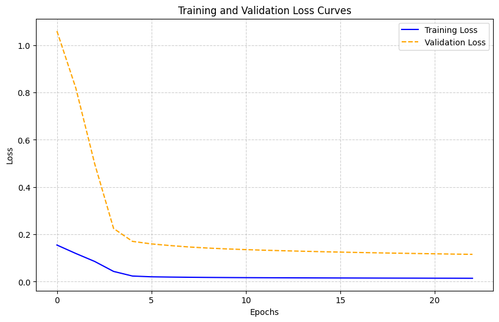
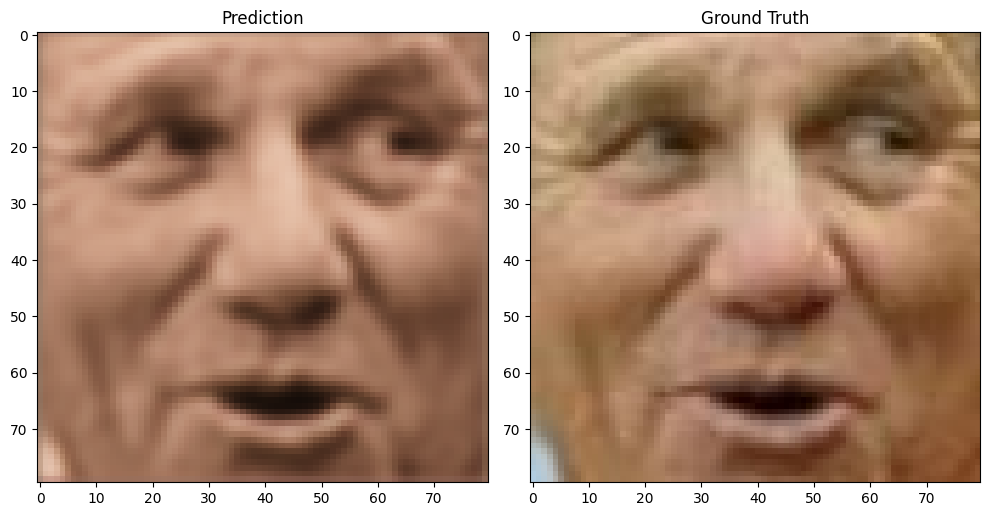

# Deep Image Colorization with PyTorch

## Overview

This repository contains a PyTorch implementation of a deep learning model for image colorization. The goal of this project is to automatically add color to black and white images using convolutional neural networks (CNNs). The model is trained on a diverse dataset of grayscale and color images to learn the mapping between grayscale input and colorized output.

## Model Architecture

The colorization model architecture is based on a U-Net-like structure, consisting of an encoder-decoder network with skip connections. The architecture is designed to capture both local and global features, allowing the model to produce realistic and visually appealing colorizations. Batch normalization and ReLU activation functions are used throughout the network to enhance training stability.

## Dataset

The model is trained on a diverse dataset that includes pairs of grayscale and color images. The dataset is preprocessed to ensure consistent sizing, and data augmentation techniques are applied to increase the model's robustness. A subset of the dataset is used for validation to monitor the model's performance during training.

## Training

The model is trained using the PyTorch framework. The training process involves minimizing the mean squared error (MSE) loss between the predicted colorized output and the ground truth color image. The Adam optimizer is used with a learning rate schedule to efficiently converge to a good solution.

The learning curves may be found below.

## Output Examples

Here are some qualitative results of the colorization model on various grayscale images:

Ground Truth 1 | Colorized Output 1

Ground Truth 2 | Colorized Output 2

### Dependencies

    Python 3.x
    PyTorch
    NumPy
    Matplotlib

### Acknowledgments

This project is inspired by the works on image colorization using deep learning, and the architecture is influenced by U-Net structures.

### License

This project is licensed under the MIT License - see the LICENSE file for details.

### Code Scripts

estimator.py: The main code of the repository. Running this code, one can directly train a model and saving the outputs on the test sets to estimations_test.npy and image names to test_images.txt.

my_evaluator.py: This code is provided to demonstrate how the evaluation and inference is made.

pre_work.ipynb: This notebook file demonstrates the work I performed throughout the preparation of my THE and report. This is important in terms of its explanatory nature.

utils.py: Utils

hw3utils.py: Utils

evaluate.py: Not used

template.py: Not used
